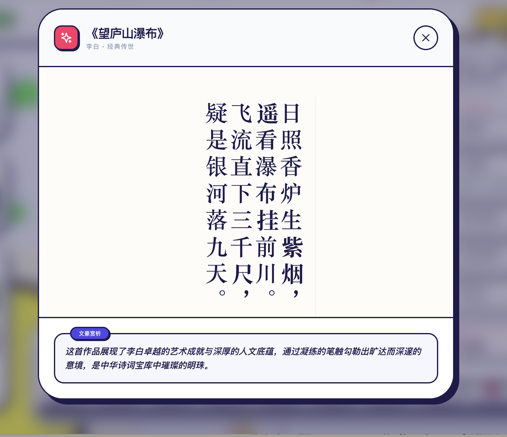

# 诗外星辰 (Verses & Voids) V3.3.2 视觉美学版

**探索诗词背后的社交宇宙。**

一个基于多巴胺波普风格 (Dopamine Pop Style) 的 3D 文人关系时空观测站。利用 3D 引力图可视化从盛唐到大清历代诗人的社交网络、影响力矩阵及传世名篇。




## ✨ V3.3.2 新特性

- **4x 高清与楷体渲染**：重制 3D 姓名标签采样逻辑，支持 **512x128** 超高清分辨率，并引入经典的 **“楷体 (KaiTi)”** 字体序列，呈现出兼具锐利度与书法底蕴的 3D 视觉。
- **纹理智能缓存 (Texture Caching)**：针对大宋等极密集节点场景，实施了底层显存优化，通过缓存 Sprite 材质极大提升了 3D 拖拽与缩放的顺滑感。
- **全场景带水印导出**：
  - **图谱截图**：支持带高对比度版权水印（LaoA's AI Lab）的高清快照捕获。
  - **诗句卡片**：在详情页支持将作品一键导出为古典竖排样式的精致海报图。
- **沉浸式全屏模式**：一键切换沉浸视野，自动隐匿 UI 面板，让感知完全聚焦于千年的名士星云。
- **极致紧凑 UI 排版**：重构了侧边栏控制中心，实现了功能网格化合并，在小屏幕设备上依然具备极高的操作视口。
- **大宋社交宇宙深度补全**：消灭了陆游、辛弃疾等核心名士的“孤点”状态，还原出基于赠答、时空交集的真实历史脉络。

## 🛠 核心技术栈

- **框架**: Next.js 14 (App Router)
- **渲染**: Three.js / React Force Graph 3D (启用 `Texture Cache` & `preserveDrawingBuffer`)
- **样式**: Vanilla CSS (Dopamine Clay Style)
- **排印**: Noto Serif SC & KaiTi (古典竖排排印系统)
- **逻辑**: 数据驱动挖掘 & 动态关联索引
- **动画**: Framer Motion & CSS keyframes

## 🚀 快速开始

```bash
# 安装依赖
npm install

# 启动开发服务器
npm run dev
```

---

**LaoA's AI Lab // 诗外星辰项目 // Version 3.3.2 Release**
